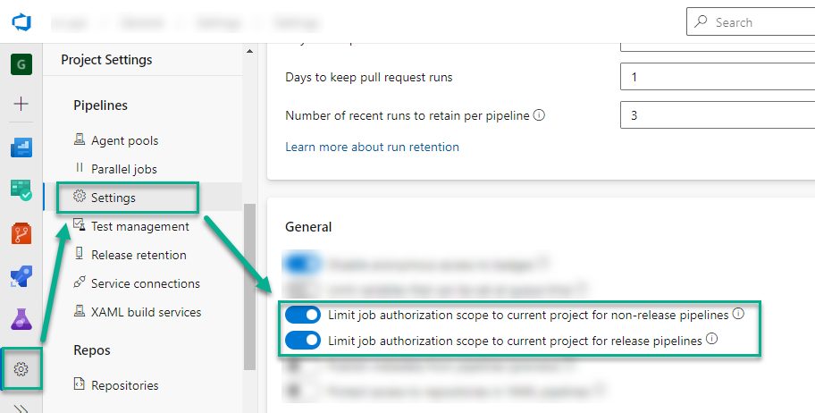
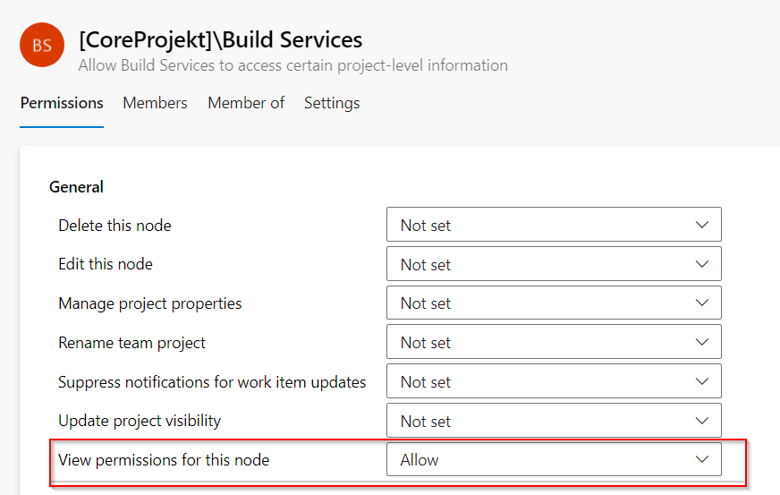
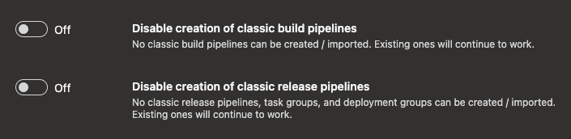

### Self-hosted agents in restricted networks

If you get errors in your pipelines like

```powershell
System.Net.Http.HttpRequestException: The SSL connection could not be established, see inner exception.
---> System.Security.Authentication.AuthenticationException: The remote certificate is invalid because of errors in the certificate chain: UntrustedRoot
```

then might a reverse proxy is blocking access to certain URLs. Make sure that the following URLs are allowed:

- https://cosmo-alpaca.westeurope.cloudapp.azure.com
- https://cosmo-alpaca-enterprise.westeurope.cloudapp.azure.com
- All from https://learn.microsoft.com/en-us/azure/devops/organizations/security/allow-list-ip-url?view=azure-devops&tabs=IP-V4#allowed-domain-urls

### My container doesn't start / the container in my pipeline doesn't start

If a container doesn't start, please always check the logs of the container, depending on your scenario either through the [VS Code Extension](../vsc-extension/open-stuff.md), the Power App or the pipeline logs. If you see something like this

```powershell
Exception calling "DownloadFile" with "2" argument(s): "The remote server returned an error: (403) Forbidden.",
Downloading license file ...
```

then very likely your license has expired and the corresponding link with it. You have to update the referenced license file in your `cosmo.json` file. [see](../containers/setup-cosmo-json.md#licensefile)

### My build pipelines sometimes fail and sometimes work with the same code

#### Error message type of 'Object lock by another user' during test automation

For automated tests, the best practice is to deactivate the task scheduler on the container. If you have this type of issue, try to modify the `dockerParamsForBuild` parameter in your `cosmo.json` file by adding the following parameter at the end : `--env customnavsettings=enabletaskscheduler=false`

### My pipelines fails because my build / release agent can't access my artifact feed

This happens in build and release pipelines as well during publish or promote universal packages. Mostly, this is caused by missing permissions for the respective build or release pipeline agent. In such a case please check the **Pipeline Settings** of your project. There are 2 options that should be enabled as follows:



#### My build agent has no access to my DevOps artifacts during build

This happens especially, when you add artifacts from an external artifact feed (from a different project in your Azure DevOps organization). In the most cases your build agent has no access to this artifact feed. In this case please:

1. Check that you added your build agent (Name: "*Project Name* Build Agent (*Organization Name*)") your external artifact feed and assigned the role Reader or Contributer.
2. Check that you added your build agent (Name: "*Project Name* Build Agent (*Organization Name*)") to your external project as a user and granted the permssion **View permissions for this node**.


### I can't create build, release pipelines or import task groups

New projects in Azure DevOps have classic build and release pipelines disabled by default. When using Alpaca Pipelines, they have to be enabled.
This can be done in the project settings (and organization settings) in Azure DevOps by enabling the features under **General**.

**Note** When setting up a new project using Alpaca, this should already be done automatically.


