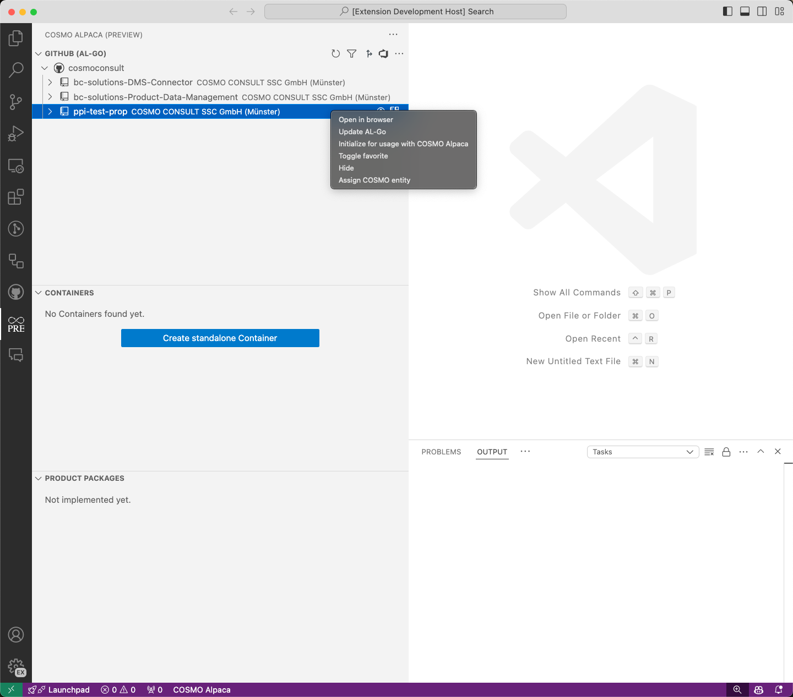
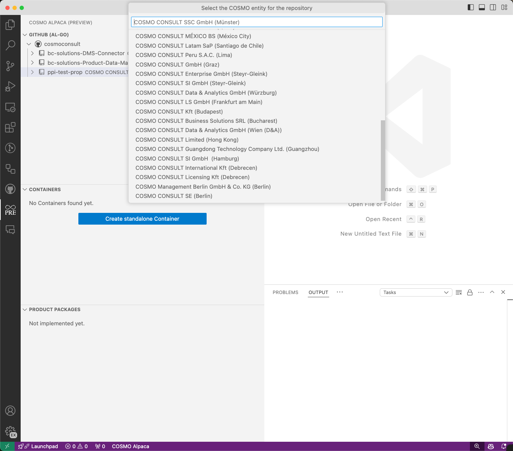
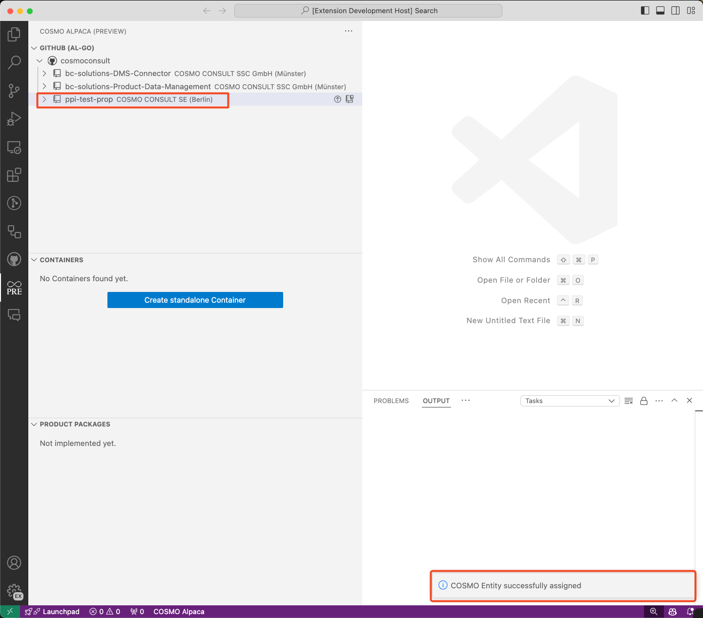

# Assign Organization/Repository to Entity
_This is only available for COSMO CONSULT_

# [**GitHub (AL-Go)**](#tab/github)

To know which entity a GitHub repository belongs, we need to assign a COSMO entity to all repositories.

To assign a repository to an entity, right-click on the repository and select **Assign COSMO entity**. 

A list of the COSMO entities will be displayed. By clicking on the COSMO entity, it will be assigned to the selected repository.

If the COSMO entity is successfully assigned, it will appear in the repository view.

# [**Azure DevOps**](#tab/azdevops)

For a couple of reasons it is important to know to which entity an organization belongs, e.g.:

- Which container backend should be used for containers connected to this organization, e.g. for [development](create-container.md)?
- Which [project customizations](customize-project.md) are available for this organization?
- Make sure the entity administrators have access to the organization

To assign an organization to an entity, right-click on the organization and select **Assign entity**. The organization you belong to according to the Azure AD will be pre-selected, but you can use any other one as well. When you select the entity, the local Azure DevOps administrators group will be added to the project collection (old name for "organization") administrators, which is also used as mechanism to later read the organization assignment. When the assignment was successful, the organization list will reload and show the newly assigned entity.

<video width="1280px" height="720px" controls>
  <source src="../media/vsc-extension-assign-entity.mp4" type="video/mp4">
  Your browser does not support the video tag.
</video>

---