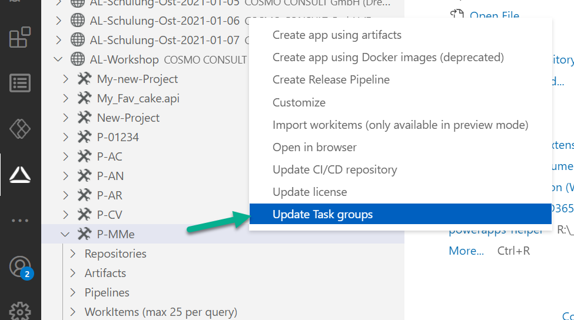

# Update CI/CD templates

# [**GitHub (AL-Go)**](#tab/github)
WIP

# [**Azure DevOps**](#tab/azdevops)

## CI Template
We have prepared different pipeline templates for you covering many Business Central versions as well as other specific needs you may have. Whenever you create a new project, the newest version of those templates is copied to a git repository called _DevOps_ within your project. After initial creation of the repository it's not automatically updated to ensure consistency and reproducability for your pipelines.

If you want to benefit from the newest changes anyway or need something which is only available in newer versions you may want to update to the latest version of the COSMO CI/CD templates:

1. In the Visual Studio Code extension right click on your project and choose **Update CI/CD repository**.
1. After a few seconds you should get a success notification that states that either your templates got updated or that you already had the newest version.

Please note that if you have customized CI/CD, this might break your customizations. You can always use the Git history to find out what change after updating, but you might need to take additional steps to get your customizations to work again.

<video width="1280px" height="720px" controls>
  <source src="../media/cicd-update.mp4" type="video/mp4">
  Your browser does not support the video tag.
</video>

## Update task group templates

We have prepared task group release pipeline templates for you covering many Business Central deployment scenarios as well as other specific needs you may have. Whenever you create a new release pipeline, the version of those templates is used. After initial creation these task groups it's not automatically updated to ensure consistency and reproducibility for your release pipelines.

**Note: The task groups are identified by name. If you change of the name, the update will not be able to update existing task group templates. It will create new task groups.**

If you want to benefit from the newest changes anyway or need something which is only available in newer versions you may want to update to the latest version of the COSMO Task Group templates:

1. In the Visual Studio Code extension right click on your project and choose **Update Task groups**.

    

1. After a few seconds you should get a success notification that states that either your templates got updated or that you already had the newest version.

**Please note that if you have customized Task groups, this might break your customizations.**

<video width="1280px" height="720px" controls>
  <source src="../media/vscode/vscode-update-task-groups.webm" type='video/webm; codecs="vp8, vorbis"'>
  Your browser does not support the video tag.
</video>

---