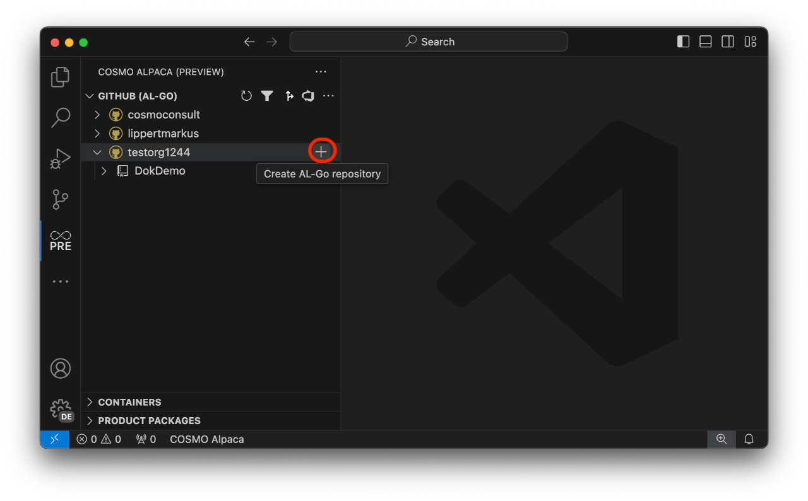

# Create a Repository & App

# [**GitHub (AL-Go)**](#tab/github)

We recommend to use an [organization][create-org] for your repositories. One repository can contain one or many [projects][create-project] that can contain one or many apps. 

## Create Repository

To create a repositoy use the `+` action next to your GitHub organization or account:

Now follow the wizard:
1. Enter the type of the new repository. Here you can choose between the PTE or AppSource Templates from Mirosoft or the respective Alpaca templates (recommended). The Alpaca templates are using Alpaca's container infrastructure for the AL-Go pipelines which can then run much faster.
1. The name of the new repository
1. Select if the new repository should be private.

With that a single-project repository will be created based on the selected tempalte. If defined, your [GitHub Repository Standards](../admin/index.md#github-repo-standards) are applied to the new repo. The new repository will contain all needed workflows and configurations.

## Create App

To create an app within your repository, select your repository and navigate the tree to `Projects > [project] > Apps` and click the `+` action:

Now follow the wizard:
1. Enter the name of the project where you want to create the app. You can use `_` to use the default root project. If you enter a project name that doesn't exist yet, the new project will be created. The repo structure might be converted from single-project to multi-project.
1. Select the type (App, TestApp or PerformanceTestApp) of the new App
1. Enter the name of the new app
1. Enter the publisher name of the new app
1. Enter the ID range of the new app

Now a workflow will run to create the new app and add all necessary files to the repository.

# [**Azure DevOps**](#tab/azdevops)

When creating a BC app using VS Code and Azure DevOps, you need an [organization][create-org] and a [project][create-project]. To create a repository for a BC app with a connected pipeline right-click on the project where you want to create a repository with a connected pipeline and select **Create app using artifacts**:

Now follow the wizard:
1. Enter a name for the new app (the repository will have the same name)
1. Select the BC version that you want to use
1. Select the country that you want to use
1. Select the license that you want to use
1. Select the auth mechanism (see param `auth` described [here](../containers/setup-cosmo-json.md#common-parameters))

With that, the new repository and pipeline will be created. It has all the basic setup and preparation needed to start working on a Business Central project including e.g. a branch policy and automatic setup of artifacts in your pipeline. After creation has finished, you will see your new repository and the new pipeline, both with the name of the app that you entered.

---

[create-org]: ../getting-started/create-org.md
[create-project]: create-project.md
