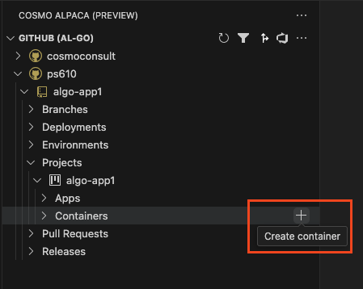
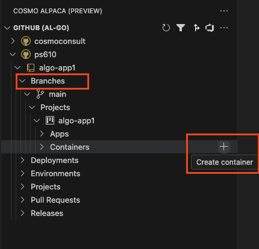

# Create Container

To develop, test or debug your app, you want to create a Business Central container. You can easily achieve that from within Visual Studio Code by following these steps:

# [**GitHub (AL-Go)**](#tab/github)

1. In the Visual Studio Code extension click on the **+** icon on the **Containers** node under the Project of your Repository.
1. Enter a name for your new container.
1. Wait until the container was created and is shown in the list. If someone else already used a similar container, this just takes a few seconds. Else this might take up to 20 minutes the first time.
1. After your container was created, the color of the icon shows the status of the container. The red icon indicates that the container is starting. As soon as the icon turns blue, the container is ready to access it.
1. You will now want to [create a configuration in your launch.json](create-launch-json.md) or [open the Web Client, terminal, file share or log](open-container.md) of your container.

## Create a container with configuration from a specific branch

To test out a change in either the `alpaca.json` without affecting other users, you can create a container and use the configuration from a specific branch:

1. In the Visual Studio Code extension click on the **+** icon on the **Containers** node under the Branches and the Project of your Repository.
1. Enter a name for your new container and hit Enter.

Similar as when [creating a container the default way](create-container.md#create-container) you need to wait until the container is created and ready.

## Select a specific container configuration when creating a new container

WIP

# [**Azure DevOps**](#tab/azdevops)

1. In the Visual Studio Code extension right click on the **Containers** node under the Repository of your App and choose **Create container**.
1. Enter a name for your new container.
1. Wait until the container was created and is shown in the list. If someone else already used a similar container, this just takes a few seconds. Else this might take up to 20 minutes the first time.
1. After your container was created, the color of the icon shows the status of the container. The red icon indicates that the container is starting. As soon as the icon turns blue, the container is ready to access it.
1. You will now want to [create a configuration in your launch.json](create-launch-json.md) or [open the Web Client, terminal, file share or log](open-container.md) of your container.

<video width="1280px" height="720px" controls>
  <source src="../media/create-container.mp4" type="video/mp4">
  Your browser does not support the video tag.
</video>

## Create a container with configuration from a specific branch

To test out a change in either the `cosmo.json` or your [custom scripts](../containers/setup-custom-scripts.md) without affecting other users, you can create a container and use the configuration and custom scripts from a specific branch:

1. In the Visual Studio Code extension right click on a branch with your changes under the Repository of your App and choose **Create container with configuration from this branch**.
1. Enter a name for your new container and hit Enter.

<video width="1280px" height="720px" controls>
  <source src="../media/branch-create-container.mp4" type="video/mp4">
  Your browser does not support the video tag.
</video>

Similar as when [creating a container the default way](create-container.md#create-container) you need to wait until the container is created and ready.

## Select a specific BC artifact configuration when creating a new container

If you have multiple BC artifact configurations set up in your `cosmo.json` file, you might want to create a container using one of those configurations other than the default, which is "current". You can do so fo by following these steps:

1. In the Visual Studio Code extension right click on the **Containers** node under the Repository of your App and choose  **Create container with artifact selection**
1. Enter a name for your new container.
1. Wait until the container was created and is shown in the list. If someone else already used a similar container, this just takes a few seconds. Else this might take up to 20 minutes the first time.
1. After your container was created, the color of the icon shows the status of the container. The red icon indicates that the container is starting. As soon as the icon turns blue, the container is ready to access it.

<video width="1280px" height="720px" controls>
  <source src="../media/vsc-extension-create-container-artifact.mp4" type="video/mp4">
  Your browser does not support the video tag.
</video>

## Select arbitrary BC artifact version and country when creating a new container

If you want to quickly create a container for a specific version and country without adding a new configuratoin to your `cosmo.json` you can do so by following these steps:

1. In the Visual Studio Code extension right click on the **Containers** node under the Repository of your App and choose  **Create container with version & country selection**
1. Enter a name for your new container.
1. Enter the version for your new container. The default version from the "current" configuration is pre-filled.
1. Enter the country for your new container. The default country from the "current" configuration is pre-filled.
1. Wait until the container was created and is shown in the list. If someone else already used a similar container, this just takes a few seconds. Else this might take up to 20 minutes the first time.
1. After your container was created, the color of the icon shows the status of the container. The red icon indicates that the container is starting. As soon as the icon turns blue, the container is ready to access it.

<video width="1280px" height="720px" controls>
  <source src="../media/vsc-extension-create-container-version.mp4" type="video/mp4">
  Your browser does not support the video tag.
</video>
