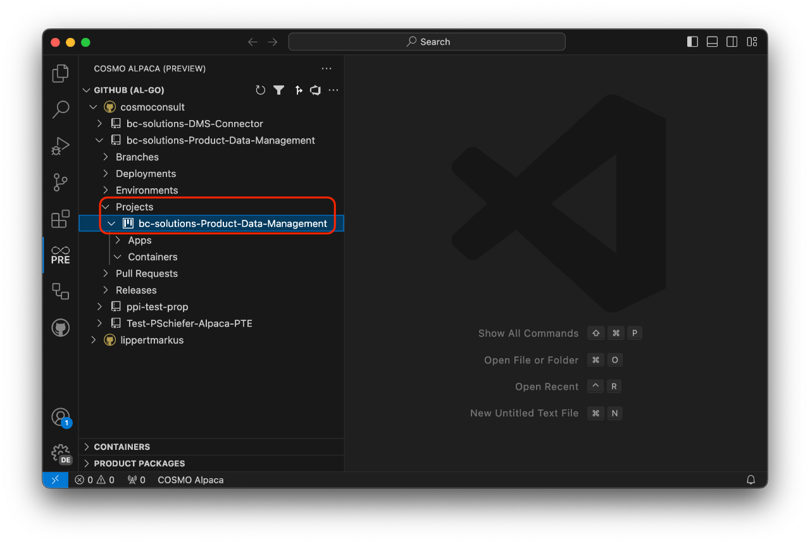
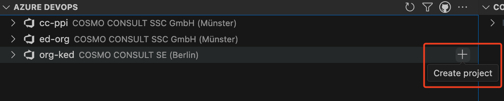

# Create Project

# [**GitHub (AL-Go)**](#tab/github)

In GitHub (AL-Go) you can cluster multiple apps into *projects*. *Projects* are just subfolders within your repository with one or many AL app directories. All apps within a project are usually shipped together. When [creating a new repository and app](create-app.md) the AL app folders by default are within the root of a repository. This is called a *single-project repository*.

In the Alpaca VSC extension the projects are listed underneath the repository:

Single-project repositories only have one project listed there that by default has the same name as the repository.

When [creating a new app](create-app.md) you can specify the project your app should belong to. This is the only way to create a new project - by creating a new app while specifying a project name that isn't existing yet.

# [**Azure DevOps**](#tab/azdevops)

When working with Azure DevOps, you need an organization (see [create org][create-org]) and a project. To create a project, you need to take the following steps:

1. Right-click on the organization where you want to create a project and select **Create project**
1. Enter a name for the new project

With that, the new project will be created. It has all the basic setup and preparation needed to start working on a Business Central project including e.g. a repository for the CI/CD automation. In the background the following extensions will be installed in the Organization:

- [Code Search](https://marketplace.visualstudio.com/items?itemName=ms.vss-code-search)
- [Pull Request Merge Conflict Extension](https://marketplace.visualstudio.com/items?itemName=ms-devlabs.conflicts-tab)
- [Generic Connection Viewer](https://marketplace.visualstudio.com/items?itemName=achermyanin.credentials-viewer)
- [AL Language Syntax Highlights](https://marketplace.visualstudio.com/items?itemName=ms-dynamics-smb.allanghighlights)

You're now ready to [create a repository with an AL app](create-app.md).

>[!NOTE]
>To add a new project in the preview Alpaca extension, use the **plus (+) icon** next to the organization name.
>
>

---

[create-org]: ../getting-started/create-org.md
