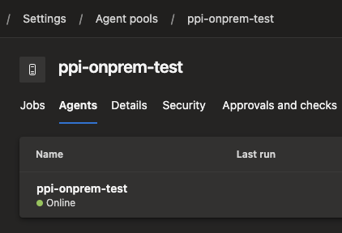
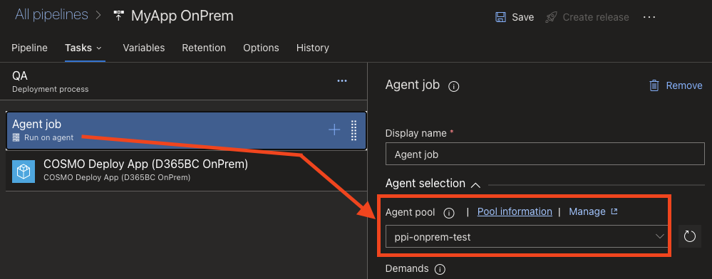
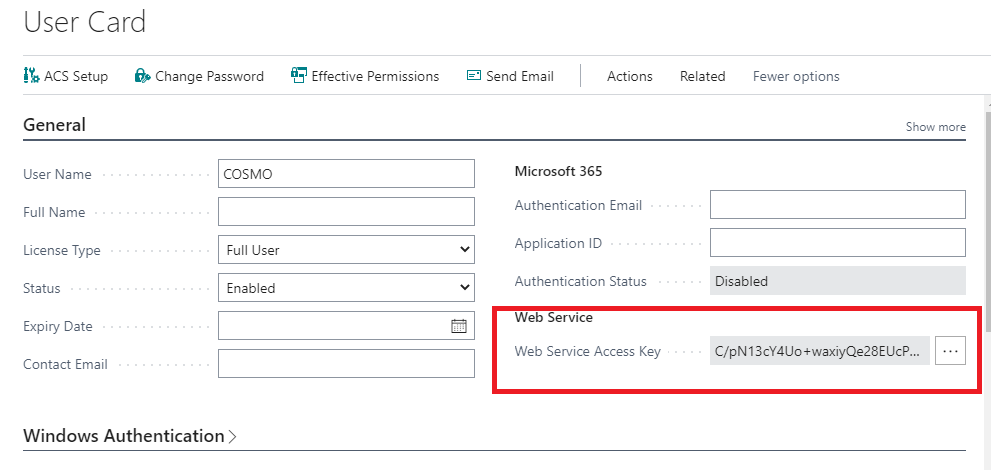
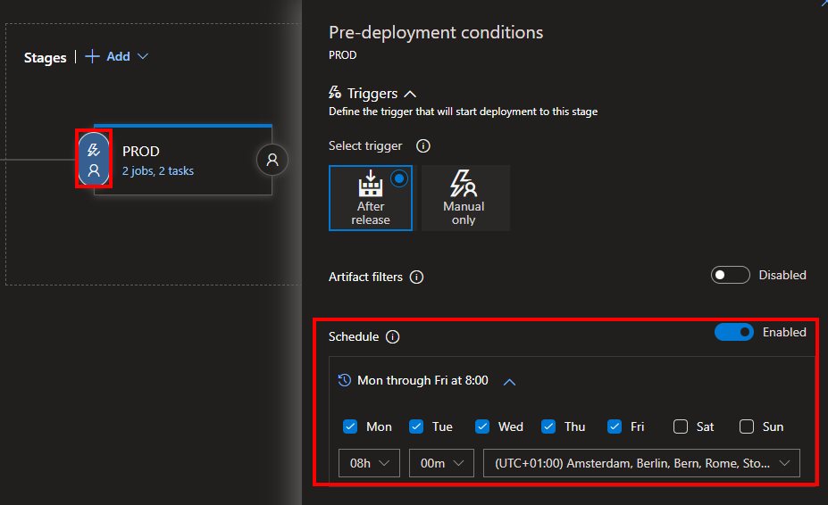
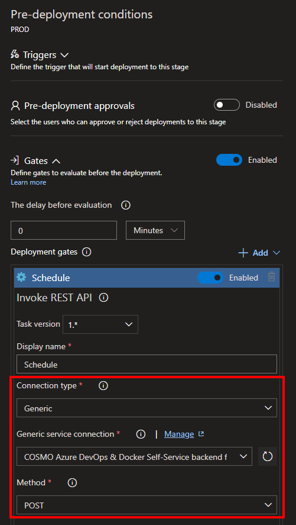
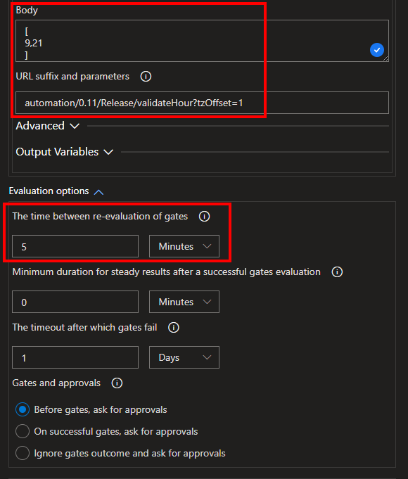
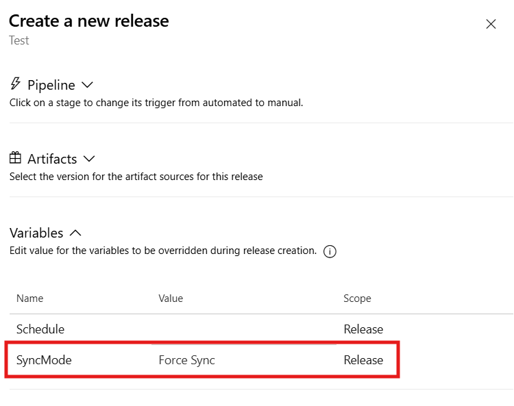
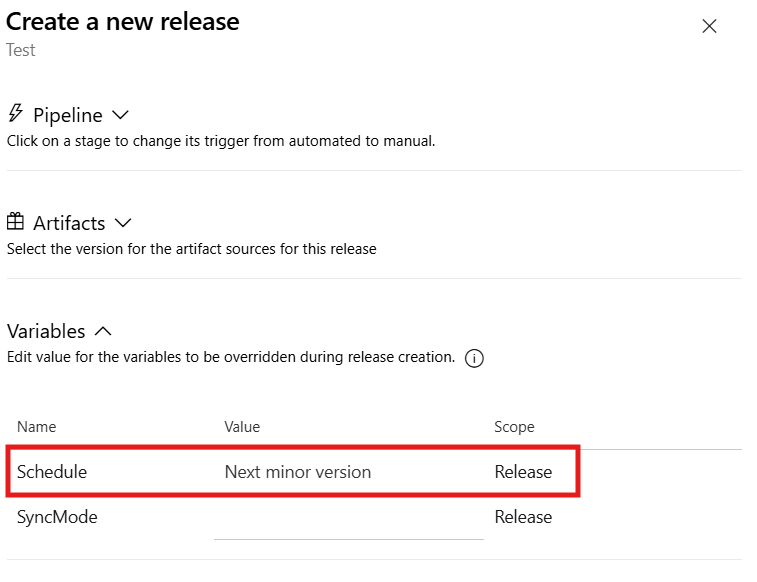
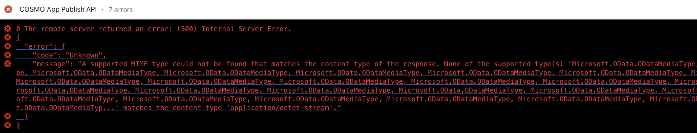

# Release your app

# [**GitHub (AL-Go)**](#tab/github)
WIP

# [**Azure DevOps**](#tab/azdevops)

## Basic Setup

When creating a release pipeline for your app using VS Code and Azure DevOps, you need an organization (see [create org](../getting-started/create-org.md)), a project (see [create project](create-project.md)), an app repository (see [create app](create-app.md)) and the imported task groups (see [update task groups](update-task-groups.md)). To create a release pipeline for your app, you need to take the following steps:

1. Right-click on the project where you want to create a release pipeline for your app and select "Create Release Pipeline"
1. Select the app repository that you want to use
1. Select the task group template that you want to use
1. Select the trigger pipeline of your app that you want to use
1. Select the release stages that you want to use
1. Select the trigger pipeline package (artifact) that you want to use
1. Enter the pipeline name that you want to use
1. Add a description for your release pipeline

With that, a new release pipeline will be created. It has all the basic setup and preparation needed to setup the deployment for your app.

<video width="1280px" height="720px" controls>
  <source src="../media/vscode/vscode-create-release-pipeline.mp4" type="video/mp4">
  Your browser does not support the video tag.
</video>

---

## Configuration

### SaaS deployment

#### Get a user with the rights to create an app registration

If there's no user in the customer tenant that has the rights to create new App Registrations you might want to create one, else you can skip the following steps:

1. Open URL https://partner.microsoft.com/commerce/customers
1. Find your customer in the list and open it
1. Open "Service Management"
1. Open "Microsoft Entra ID" (ex. "Azure Active Directory")
1. Open "Microsoft Entra ID" (ex. "Azure Active Directory") once more on the left
   * Go to users
   * Click on "New user"
     * Select "Create user"
     * Fill in username (e.g. "bcadmin")
     * Click on "Roles" and select "Global Administrator"
     * Click on "Create"
     * **Important**: Continue the following steps with the newly created user
     * **Please note**: This step might be unnecessary if a "Global Administrator" from within the customer tenant is creating the App Registration. It's only relevant, if you do the steps in Microsoft Entra ID (ex. Azure Active Directy) with credentials from outside the customers tenant (e.g. when doing this via Partner Center). Please also note, that you'll need a user with "Global Administrator"-role later for the ["Register the Microsoft Entra application"](#register-the-microsoft-entra-application-in-business-central)-step

#### Create the app registration

1. Open "App Registrations"
1. Click "Add new registration"
   * Add a custom name, e.g. "COSMO"
   * Select "Accounts in any organizational directory (Any Microsoft Entra ID tenant - Multitenant)"
   * Set the Redirect URI to: https://businesscentral.dynamics.com/OAuthLanding.htm
   * Click on "Register"
1. Click on the newly created app
   * Open "API Permissions"
   * Click on "Add Permission"
   * Select "Dynamics 365 Business Central"
   * Select "Application Permissions"
   * Select "Automation.ReadWrite.All"
   * Click on "Add permissions"
   * Now select your newly created API Permission and click on the button "Grant admin consent for *CustomerName*.onmicrosoft.com"
1. Click on "Certificates & secrets"
   * Click on "New client secret"
   * Add a description
   * Add the expiration date
   * Click on "Add"
   * Important: Copy the "value" of the secret right away! It won't be fully shown later on. This is the **ClientSecret** needed for the variable groups
1. Select "Overview"
     * The "Application (client) ID" is the **ClientId** needed for the variable groups

#### Register the Microsoft Entra application in Business Central Admin Center

1. Open the Business Central Admin Center
2. Navigate to Microsoft Entra Apps
3. Click on "Authorize Microsoft Entra app"
4. Fill in the ClientId from the previous step
5. Click on the link "Grant"
   * A page with a required Login opens
   * Use the newly created user from the previous step or another user with "Global Administrator"-role and continue
   * Accept the requested permissions and the page should close afterwards
6. The Microsoft Entra application is now authorized for the admin center API

#### Register the Microsoft Entra application in Business Central

1. Open the Business Central Webclient
2. Search for "Microsoft Entra Applications" (ex. "AAD Applications") and open the page
3. Click on "New"
4. Fill in the ClientId from the step "Create the app registration"
5. Fill in a custom description
6. Click on the action "Grant Consent"
   * A page with a required Login opens
   * Use the newly created user from the previous step or another user with "Global Administrator"-role and continue
   * Accept the requested permissions and the page should close afterwards
7. Look at the bottom of the Microsoft Entra application page and add the following
   * "D365 AUTOMATION"
   * "EXTEN. MGT. - ADMIN"
   * *additional permission sets required by partner apps (e.g. "CCS LIC ALL" for COSMO Licensing)*
8. Your Microsoft Entra application is now fully set up!

Note: This step needs to be done for each environment you want to create a release pipeline for.

#### Setup the configuration in Azure DevOps

1. Open "Pipelines/Library" in Azure DevOps
2. Open Variable Group "D365BC Deployment"
3. Fill in the mandatory variables

|Variable Name|Value|
|-|-|
|`"ClientId"`|Shown in "ClientId & ClientSecret"|
|`"ClientSecret"`|Shown in "ClientId & ClientSecret"|
|`"TenantId"`|Shown in the link to the webclient you are aiming for, e.g. |
|`"Environment.*Name*"`|Shown in "Environments" -> Open URL https://businesscentral.dynamics.com/**TenantId**/admin|

**Finished! Now your release pipeline should be ready to go!**

### OnPrem Deployment

#### Deploying via PowerShell

Although deployment via Automation API is preferred and much more secure ([see next section](#deploying-via-automation-api-oauth-or-basic-auth) you can also install a Build Agent directly on the target machine like described in the [docs](https://learn.microsoft.com/en-us/azure/devops/pipelines/agents/windows-agent?view=azure-devops). Please use a separate Agent Pool for the Build Agent and set this Pool within your release pipeline.

When creating new release pipeline, choose the option **"COSMO Deploy App (D365BC OnPrem)"**

1. Install and configure the Build Agent on the target machine. It will then be available in the Azure DevOps Pool.

   

   **Note:** It is recommended to set up a maintenance job for the Build Agent to clean up the agent's work directory. This can be done by adding a maintenance job to the agent pool like described in the [docs](https://learn.microsoft.com/en-us/azure/devops/pipelines/agents/pools-queues?view=azure-devops&tabs=yaml%2Cbrowser#what-is-a-maintenance-job).

2. Replace the agent pool in the created release pipline with the pool where the Build Agent is located.

   

##### Setup the configuration in Azure DevOps

1. Open "Pipelines/  Library" in Azure DevOps
2. Open Variable Group "D365BC Deployment"
3. Fill in the mandatory variables

|Variable Name|Value|
|-|-|
|`"serverInstance.*Name*"`|The Name of the ServerInstance|

**Finished! Now your release pipeline should be ready to go!**

#### Deploying via Automation API (OAuth or Basic Auth)

When creating new release pipeline, choose the option **"COSMO Deploy App (D365BC OnPrem API)"**

Now you need to enable the Automation API for your OnPrem environment:

1. In Windows PowerShell install ExternalDeployer:

   ```PowerShell
   Install-Module ALOps.ExternalDeployer -Force 
   Import-Module ALOps.ExternalDeployer 
   Install-ALOpsExternalDeployer -ServerInstance <Your Server Instance>
   ```

2. Restart Server Instance (as indicated when the scripts are executed)
3. Generate Web Service Access Key (Password) for the User which should be used to access the Automation API

   

4. The API should be reachable from external ("https://**Url**/**ServerInstance**/api/microsoft/automation/v1.0/companies")
   * **Important** : If errors occur, you need to contact local or global IT to open the  appropriate port and to enable authentication.

##### Setup the configuration in Azure DevOps

1. Open "Pipelines/  Library" in Azure DevOps
2. Open Variable Group "D365BC Deployment"
3. Fill in the mandatory variables

|Variable Name|Value|
|-|-|
|`"Username"`|The user which is used to access the Automation API"|
|`"Password"`|The Web Service Access Key (Password) of the user which is used to access the Automation API"|
|`"Endpoint.*Name*"`|The URL including the Name of the ServerInstance|

**Finished! Now your release pipeline should be ready to go!**

### Advanced

#### Schedule

Azure Devops allows to configure a schedule for a specified stage as a pre-deployment condition, which triggers the deployment of the release at a specific time. This is useful for example for deploymens to a production environment, which should be done at a specific time, e.g. during the night.

To configure a schedule for a stage:

1. Open the release pipeline
1. Select the stage you want to configure the schedule for
1. Click on the "Pre-deployment conditions" tab
1. Select "Triggers"
1. Select "Schedule"
1. Configure the schedule by specifying the time and days when the deployment should be triggered.



Be aware when combining the schedule with other pre-deployment conditions, e.g. approvals, as the stage will only be triggered/actived if the schedule is met. This means that approval checks and notifications will be sent out at the time of the schedule, what you might not expect or want.

Find more information in the [official documentation](https://learn.microsoft.com/en-us/azure/devops/pipelines/release/triggers?view=azure-devops#stage-triggers).

#### Multiple Schedules

Since Azure DevOps does only support one schedule per stage, it is difficult to configure multiple schedules for one stage. However, it is possible to create duplicate stages for the same environment and configure a different schedule for each stage.
To simplify this configration, we provide an API endpoint, which can be invoked as a gate for the stage. This means the API call represents a "schedule gate".

To configure the API call as a gate:

1. Open the release pipeline
1. Select the stage you want to configure the schedule for
1. Click on the "Pre-deployment conditions" tab
1. Select "Gates"
1. Add a new Gate and select "Invoke REST API"
1. Give the gate a display name
1. Select connection type "Generic"
1. Select the COSMO Alpaca service connection (named like "COSMO Azure DevOps & Docker Self-Service backend for project...")
1. Select method "POST"
1. Provide the valid hours for the schedule in the body: (e.g. for 9 and 21 o'clock, which actually means the time windows between 9-10 and 21-22 o'clock are valid)

   ```json
   [ 9,12 ]
   ```

1. Set the URL suffix and parameters to:

   ```json
   automation/0.11/Release/validateHour?tzOffset=1
   ```

   The `tzOffset` parameter is optional and can be used to adjust the time zone offset. The value is the time zone offset in hours. For example, if the time zone is UTC+1, the value is 1. If the time zone is UTC-5, the value is -5.
1. Configure time between the re-evaluation of the gate under "Evaluation options" as needed (e.g. 15 minutes)




#### Deployment with ForceSync

To deploy a release with a forced schema synchronization, set the variable `SyncMode` when creating the release.
These values are available: `Add` *(default)*, `Force Sync`



#### Deployment for next Minor/Major version

To deploy a release for the next minor/major version, set the variable `Schedule` when creating the release.
These values are available: `Current version` *(default)*, `Next minor version`, `Next major version`



### Known Issues

In case your (OnPrem API) Release Pipeline fails with the following error:



If you’re running BC22 or higher, check if the BC service parameter “ManagementApiServicesEnabled” is set to true or not. If not, set it to true.

```PowerShell
Set-NavServerConfiguration -ServerInstance [Servicename] -Keyname "ManagementApiServicesEnabled" -KeyValue $true
```

This will be set automatically in the installation process of the ALOps.ExternalDeployer in a version higher than "1.59".
You may need to update the ALOps.ExternalDeployer too. You should follow these instructions to do so:

1. In Windows PowerShell uninstall ExternalDeployer:

```PowerShell
Import-Module ALOps.ExternalDeployer
# Remove all currently installed AlOps Services:
Remove-ALOpsExternalDeployer -ServiceName ‘ALOpsExternalDeployer$[Servicename]’
Uninstall-Module ALOps.ExternalDeployer
```

2. Check if the Module is completely deleted
   - Open the following Directory: "C:\Program Files\WindowsPowerShell\Modules"
   - You should'nt see a folder named "ALOps.ExternalDeployer". If you do, you may delete it manually.
3. Install ExternalDeployer again, follow "normal" installation instructions ([see above](#deploying-via-automation-api-oauth-or-basic-auth))

---