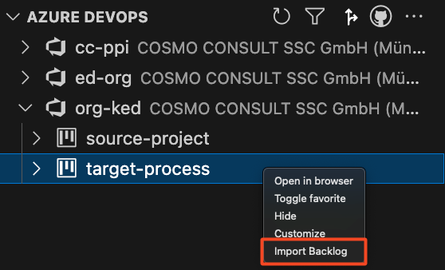

# Importing a Backlog from Another Azure DevOps Project

The extension provides a convenient way to import an entire backlog from one Azure DevOps project into another. This feature allows you to quickly replicate existing work items and relationships across projects without manual re-entry.

> [!WARNING]
> The source and target projects must use the same process customization for a successful backlog import ([customize project](customize-project.md)).

> [!NOTE]
> Depending on the size of the backlog, the import may take several minutes.  

---

## How to Import a Backlog

### 1. Right-Click on the Target Project
Locate the project into which you want to import the backlog.  
Right-click on the project name and select **Import Backlog** from the context menu.

   

---

### 2. Select the Source Organization
A dialog will appear asking you to select the organization that contains the project you want to copy from.  
Choose the appropriate organization.  

   

---

### 3. Select the Source Project
After selecting the organization, the extension will prompt you to select a project within that organization.  
Choose the project that contains the backlog you wish to import.  

   

---

### 4. Start the Import
Once both the source organization and project are selected, the extension will begin the import process.  
A progress notification will be displayed in VS Code. 

After the process finishes, the backlog from the source project is transferred into the selected target project.  
You can now browse and work with the imported items as part of your project.
