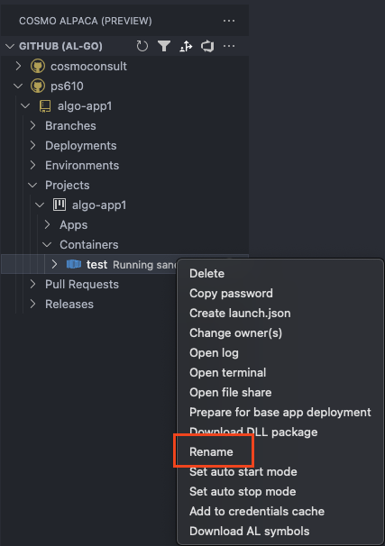

# Rename Container

If you want to rename a container, you can take the following steps:

> [!IMPORTANT]
> Renaming a container will restart the container if it runs.

# [**GitHub (AL-Go)**](#tab/github)

1. Right-click on the container you want to rename
2. Select **Rename**
3. Confirm that you want to rename the container which will **restart a running container**.
4. Enter the new container name
5. The container is renamed and automatically restarted so the change is applied

# [**Azure DevOps**](#tab/azdevops)

1. Click on the container to select it
2. Open the command palette (F1) and choose **COSMO Alpaca: Rename container (display name)**
3. Confirm that you want to rename the container which will **restart a running container**.
4. Enter the new container name
5. The container is renamed and automatically restarted so the change is applied

<video width="1280px" height="720px" controls>
  <source src="../media/rename-container.mp4" type="video/mp4">
  Your browser does not support the video tag.
</video>
