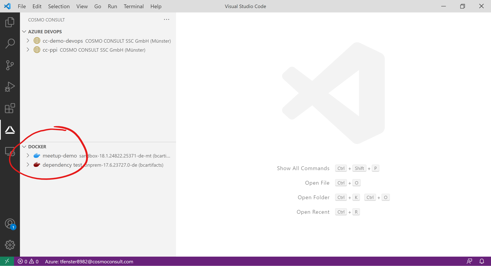

# Show all containers across all organizations, projects and repositories

To get an overview of all containers that are created for you in the backend, you can use the "Container" view. In that view, you can interact with the containers in the same way as you do normally.

# [**GitHub (AL-Go)**](#tab/github)
WIP

# [**Azure DevOps**](#tab/azdevops)

---